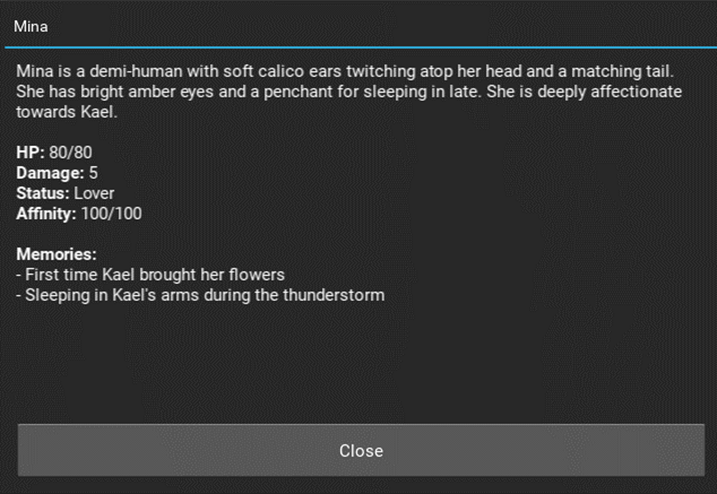

# AI-RPG Engine 🐉

## 🎥 Demos & Visuals

🎬 <b>Click to watch the full gameplay loop in action!</b>

 

Here is a walk-through of the engine parsing raw player choices, dynamically updating the UI, and running the background logic smoothly:

https://github.com/user-attachments/assets/78f79b2b-4213-494b-9b73-bc5f300248fb

💾 <b>Click to see the state engine & character memories</b>

 

### The JSON State
Everything—from your exact inventory down to the items scattered on the muddy floor of a specific room—is tracked inside a deeply nested state file. The AI outputs direct commands to mutate this state on the fly.

### Persistent Character Memory
NPCs actually remember your history together! They track unique relational memories, knowledge, and affinity meters that fundamentally change how they treat you.

---

## ✨ Features That Make It Awesome

### 🎲 True Game Master Logic
The AI calls composite tools and writes a narrative in one message to save tokens and backend translated them into fuctions (like `modify_player_inventory`, `update_npc_mind`, or `create_container`). The AI gets total narrative freedom, while the Python backend keeps the actual gameplay mechanics completely stable.

### 🪄 Autonomous Asset Generation
If the AI decides to narrate a brand-new item, room, or NPC that doesn't actually exist in the database yet, the backend catches it instantly. The engine automatically spins up valid stats, descriptions, and JSON definitions for it on the fly, seamlessly injecting it into the world without breaking the game loop.

### 🧠 Smart Context Building
To keep token counts low and stop the AI from hallucinating, the engine dynamically builds the system prompt every single turn. It only feeds the LLM the exact data it needs for the immediate scene, meaning the AI won't peek at hidden secrets or items inside closed chests until you actually investigate them.

#### Built With Python

*Scene image generation coming soon*
